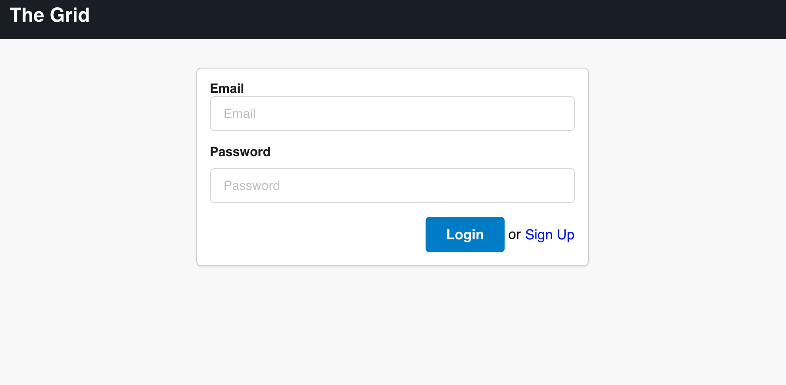
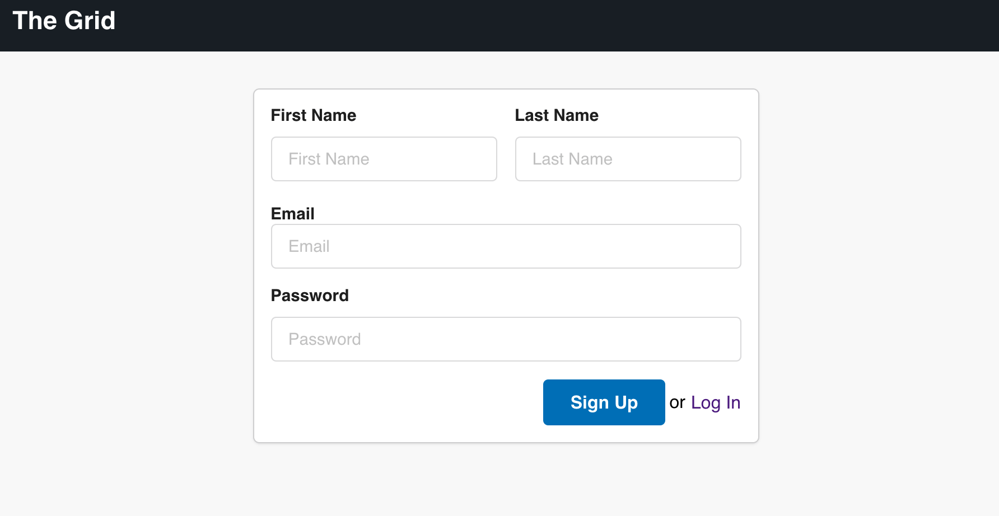
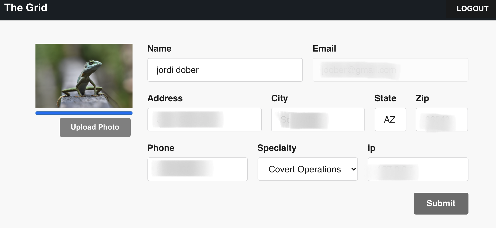
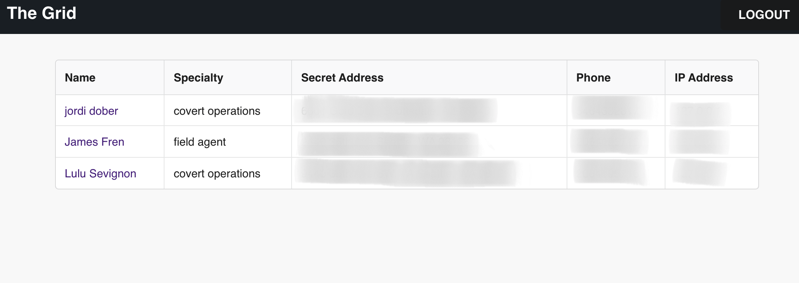

# legendes

### Serverless React app powered by Firebase

## Welcome to the Grid
We will help you keep your legendes (your spys) on track!

## Business Requirements
You are an intelligence agency. This app allows your spys to create their profile and put in their information. The boss can keep track of their team of active spies.

### Key features
- A spy can create their profile and fill in their informatiosn
- A spy has only access to their profile and can modify it as needed
- The boss has the admin ability
- The boss can see the list of all profiles
- The boss can modify the profile of any spy

### Tech
- firebase
- authentication
- routing
- react hooks
- serverless computing
- react
- Semantic UI

### Firebase tools:

- Firebase Authentication to add authentication to my app
- Data stored on Firebase Cloud Firestore
- App deployed on Firebase Hosting

### Deployed App
[Follow this link to access the deployed app](https://grid-legends.web.app/login)

## UI
### Log In page

### Register page

### Spy profile page

### Boss view page

### Available Scripts

In the project directory, you can run:

npm start
Runs the app in the development mode.
Open http://localhost:3000 to view it in the browser.

